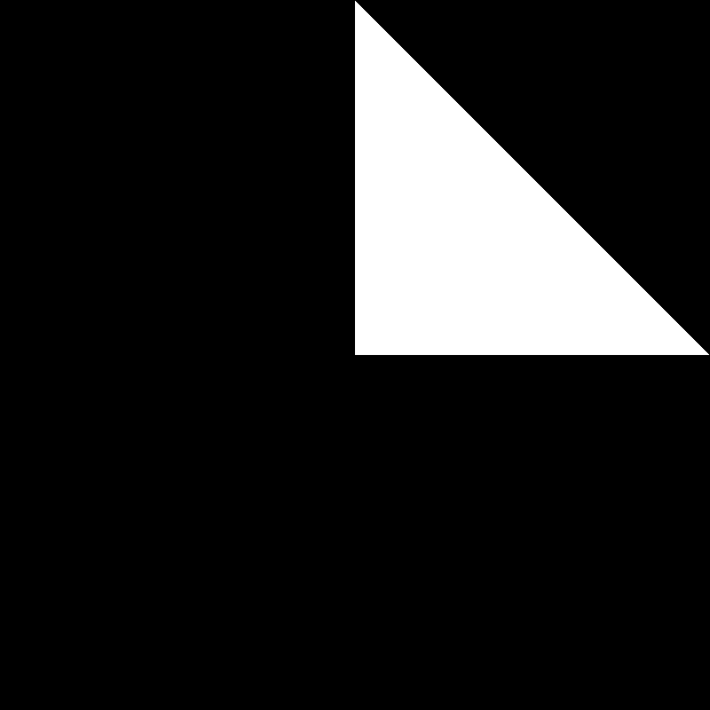
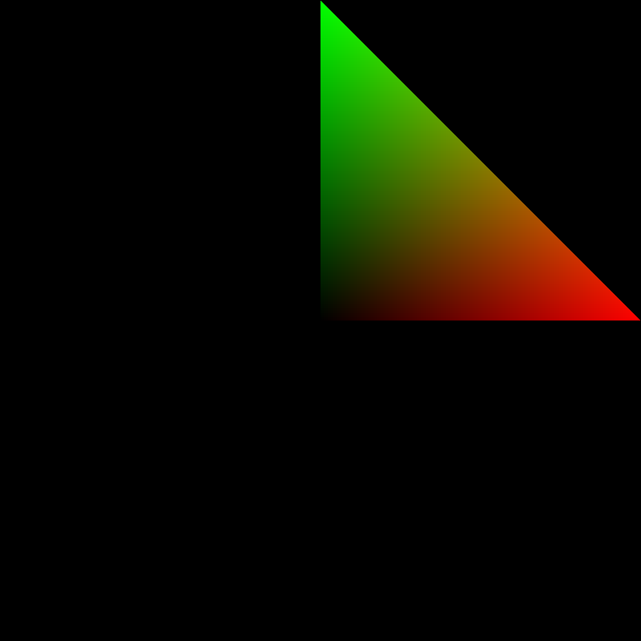
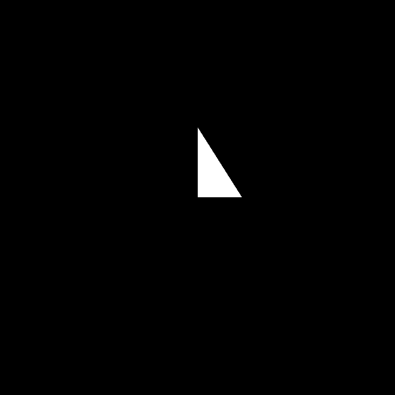
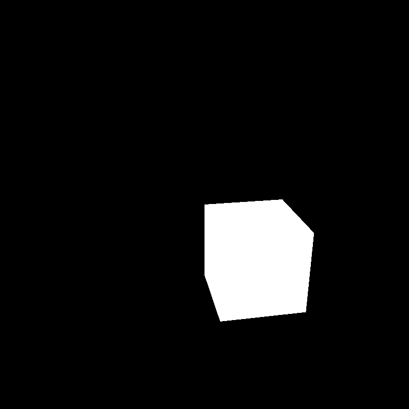
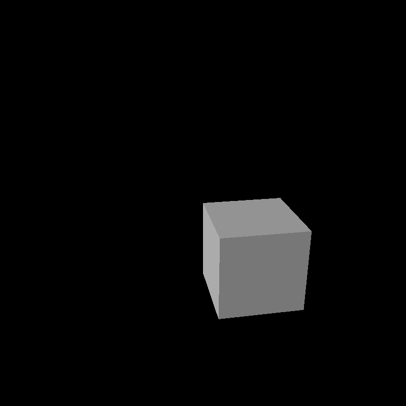

# Naivegl

naive software renderer for learning purpose

## Features
- use all CPU cores but none of GPU
- shader based rendering (vertex shader and fragment shader are supported currently)

## Roadmap

- [x] draw a white triangle
    - [x] basic triangle rasterizer
    - [x] basic pipeline

- [x] draw a triangle with interpolated color
    - [x] calculate barycentric coords to interpolate vertex attributes

- [x] draw a triangle with a perspective camera
    - [x] implement mvp matrix transform
    - [x] implement naive clipping (remove the triangle when one of its vertices is out of the frustum)
    - [x] implement homogeneous division and screen mapping

- [ ] draw a white cube with a perspective camera
    - [ ] implement z-buffer and z-test

- [x] draw a cube with diffuse shading
    - [x] calculate normal vector using two edges of a triangle

